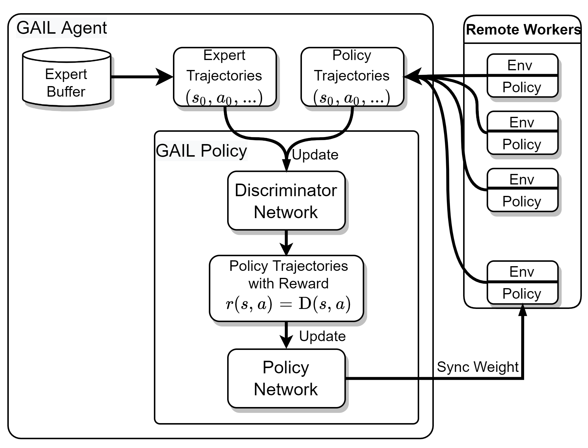

## 特定进球风格的足球AI模仿学习（基于GRF 5v5环境）
### **Tip:**
在项目目录下执行以下命令，创建专家数据集文件夹，将准备好的hdf5数据集放置在`.grf/datasets`中
```bash
mkdir -p .grf/datasets
```
### **Example:**
执行如下代码即可进行训练（或者查看`grf_imitation/scripts/run_gail.py`文件，自己撰写bash脚本训练）
```bash
python examples/football_gail.py
or
./examples/football_gail.sh
```

执行如下代码可对某个训练好的Model进行评估
```bash
python examples/football_evaluate.py
```
### **Framework:**

